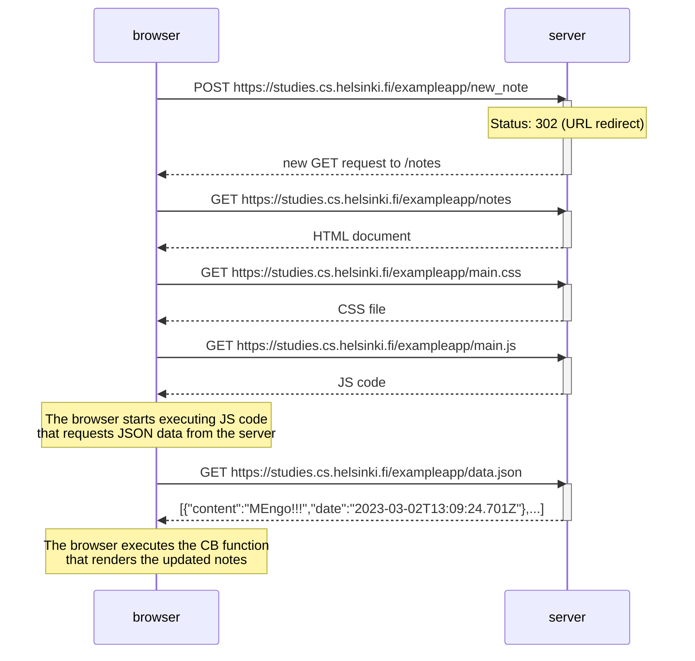
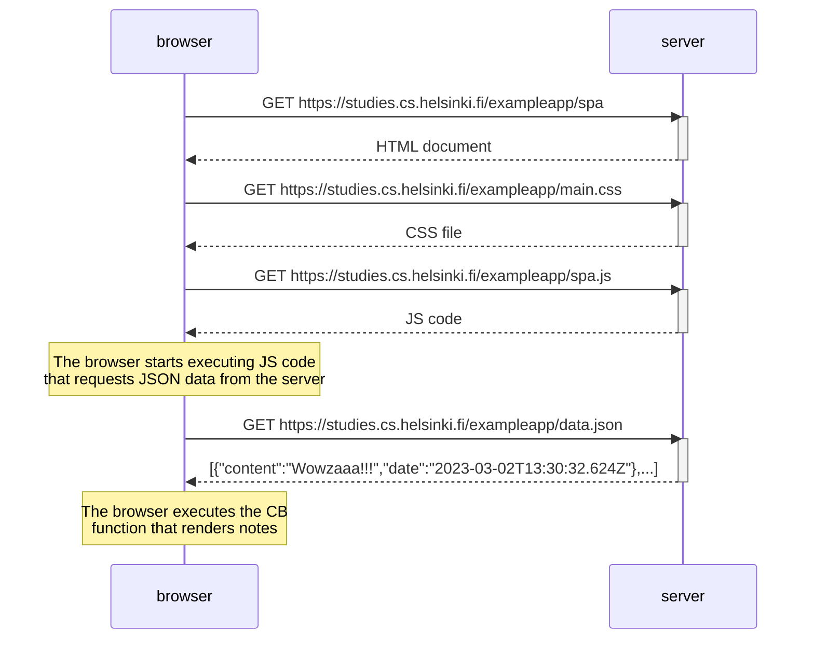
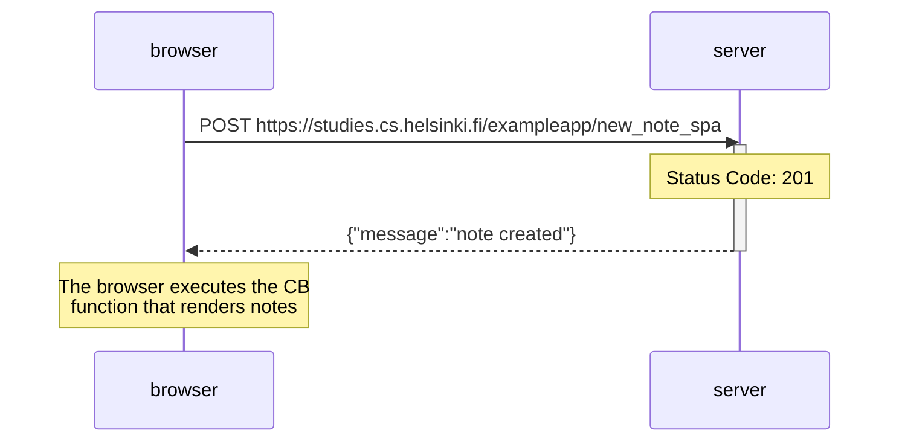

# Fullstack
## Part 0: Fundamentals of Web apps

### Exercises 0.1 - 0.6

**0.1: HTML**  
:white_check_mark: Review the basics of HTML by reading this tutorial from Mozilla: [HTML tutorial](https://developer.mozilla.org/en-US/docs/Learn/Getting_started_with_the_web/HTML_basics).
***
**0.2: CSS**  
:white_check_mark: Review the basics of CSS by reading this tutorial from Mozilla: [CSS tutorial](https://developer.mozilla.org/en-US/docs/Learn/Getting_started_with_the_web/CSS_basics).
***
**0.3: HTML forms**  
:white_check_mark: Learn about the basics of HTML forms by reading Mozilla's tutorial [Your first form](https://developer.mozilla.org/en-US/docs/Learn/Forms/Your_first_form).
***
**0.4: New note diagram**  
In the section Loading a page containing JavaScript: review, the chain of events caused by opening the page https://studies.cs.helsinki.fi/exampleapp/notes is depicted as a sequence diagram.

:white_check_mark: Create a similar diagram depicting the situation where the user creates a new note on the page https://studies.cs.helsinki.fi/exampleapp/notes by writing something into the text field and clicking the submit button.

***
**0.5: Single page app diagram**  
:white_check_mark: Create a diagram depicting the situation where the user goes to the single-page app version of the notes app at https://studies.cs.helsinki.fi/exampleapp/spa.

***
**0.6: New note in Single page app diagram**  
:white_check_mark: Create a diagram depicting the situation where the user creates a new note using the single-page version of the app.

